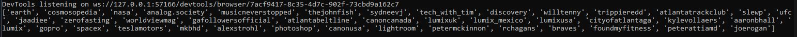

# InstaBot Finds Unfollowers

A bot powered with Selenium using Python utilizes OOP protocol to fetch those who have unfollowed you.

## Program output:

The majority of the code is commented out for an easier understanding. Beware that Instagram is constantly changing their front end,
so this code will need updating in the future. However, the same methodology will apply: copy the full XPath of your desired element 
and insert it into the program. 

I hope this helps anyone who is looking into doing a cool project like this!
